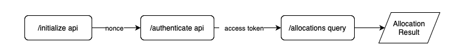

# Anime Multi Checker

A simple Node.js tool for automating the SIWE (Sign-In with Ethereum) flow and checking ANIME token allocations for multiple wallets.


## How it works
It works by following the steps of the official online checker [https://www.anime.xyz/checker](https://www.anime.xyz/checker). First it receives the nonce and signs the login message with the private key (it doesn't send it to server) and then it checks the allocation with the acquired access token. Finally displays the results in the console.



---

## Prerequisites

1. **Node.js** (version 18.xx or later recommended)  
   - If you have not installed Node.js, visit the [official Node.js downloads page](https://nodejs.org/) to download and install for your operating system.
2. `keys.txt` file containing private keys (one key per line).

---

## Installation

1. **Clone or download** this repository.  
2. **Install Node.js** if you haven’t already. [Download Node.js here](https://nodejs.org/).
3. **Navigate** to the folder containing the `index.js` in your terminal.  (Or double click the `start.bat` if you are on windows)
4. **Install required npm packages**:

   ```bash
   npm install
   ```

---

## Usage

1. **Prepare your `keys.txt` file**, placing one Ethereum private key per line:
   ```
   0x123abc...
   0x456def...
   0x789...
   ```
2. **Run the script** in your terminal:

   ```bash
   node index.js
   ```

3. **View the console output** to see each wallet address and corresponding ANIME allocation.  

---

## Notes

- Rate-limiting (HTTP 429 errors) may occur if you query too many wallets too quickly.  
- This tool is for educational and testing purposes only.